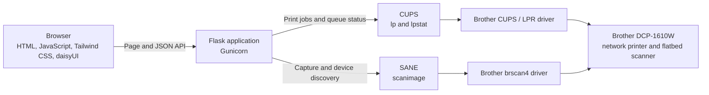

# Brother Document Station

Brother Document Station is a self-hosted web application for printing files
and scanning documents with a network-connected Brother DCP-1610W. The browser
provides a responsive interface; Flask coordinates print and scan requests;
and CUPS and SANE communicate with the device using Brother's Linux drivers.

## Architecture



### Application layers

- **Web interface** — Flask template at `templates/index.html`;
  `static/js/app.js` handles navigation, API calls, previews, scan sessions,
  and browser-side print profiles.
- **Localization catalogs** — `static/locales/` contains one JSON document
  per language, including interface copy, API message display text, and
  accessibility text. The browser owns all localization.
- **Frontend assets** — `assets/input.css`, `tailwind.config.js`, and
  `package.json` define Tailwind CSS and daisyUI. The generated stylesheet
  is copied into the runtime image.
- **Application setup** — `scanner-app/src/scanner_app/app.py` creates the
  Flask application and configures request hooks and error handling.
- **Shared constants** — `scanner-app/src/scanner_app/constants.py` defines
  documented scanner, printer, storage, and upload limits and defaults.
- **HTTP layer** — `scanner-app/src/scanner_app/routes.py` renders the page,
  validates API requests, and coordinates print and scan operations.
- **Printing** — `scanner-app/src/scanner_app/printing.py` validates print
  settings, prepares files and overlays, submits CUPS jobs, and reads status.
- **Scanning** — `scanner-app/src/scanner_app/scanning.py` discovers the
  scanner, captures and adjusts images, exports output, and composes pages.
- **Temporary storage** —
  `scanner-app/src/scanner_app/temporary_storage.py` creates private scan
  sessions and removes expired data.
- **System commands** — `scanner-app/src/scanner_app/processes.py` runs
  bounded subprocesses without shell interpretation.
- **Runtime settings** — `scanner-app/src/scanner_app/settings.py` loads
  temporary paths, queue name, and upload-size limits.
- **Container startup** — `docker/` configures CUPS and SANE and supervises
  the web and print services.

### Request flows

The browser talks to Flask through these page and JSON routes:

- `GET /` — Render the print and scan interface.
- `GET /api/status` — Report CUPS and SANE readiness.
- `POST /api/print` — Validate an upload and submit a print job.
- `POST /api/scan` — Capture a page and return temporary artifact IDs.
- `POST /api/scans/compose` — Compose a multipage or ID-card PDF.
- `GET /api/preview/<session>/<artifact>` — Return an inline PNG preview.
- `GET /api/download/<session>/<artifact>` — Download an artifact and close
  its session.
- `DELETE /api/scans/sessions/<session>` — Close and remove a scan session.

**Printing:** The browser uploads a PDF or supported image to
`POST /api/print`. Flask validates the print options and file, prepares any
required conversion or overlay in a temporary directory, and submits the job
to CUPS. The application removes its working files after submission; CUPS
keeps its own spool copy while the job is being processed.

**Scanning:** The browser sends scan settings to `POST /api/scan`. Flask
invokes `scanimage` through SANE and stores each capture in a private,
temporary scan session. Preview and download endpoints serve the session's
artifacts. Continuous scanning captures one sheet at a time and can compose
the pages into a multipage PDF. ID-card mode captures both sides separately
and places them on an A4 page. A completed download or explicit session close
removes the session; inactive sessions expire after one hour.

The DCP-1610W has a flatbed scanner rather than an automatic document feeder.
Continuous scanning requires the user to replace each page on the glass.

## Container build

The Dockerfile uses separate build stages so frontend tooling and Python build
dependencies are not part of the final image:

1. **Frontend build:** Node.js installs Tailwind CSS and daisyUI and compiles a
   minified stylesheet.
2. **Python build:** `uv` installs the locked, production-only Python
   dependencies and the application package.
3. **Runtime:** A Python slim image contains Flask/Gunicorn, CUPS, SANE, the
   Brother DCP-1610W CUPS/LPR driver, and Brother's `brscan4` driver. It copies
   in the compiled stylesheet and Python virtual environment, but not
   Node.js, npm, or build tools.

The Brother print driver is 32-bit while `brscan4` is 64-bit x86, so the image
is intended for `linux/amd64`. At startup, `docker/start-web.sh` configures the
CUPS queue and registers the scanner from `PRINTER_IP`. Supervisor runs CUPS
and the web process; Gunicorn serves Flask on port 8080 as the unprivileged
`app` user.

## Configure and run

The printer must be reachable from the Docker host over the network. Set its
IP address in a root-level `.env` file:

```dotenv
PRINTER_IP=192.168.1.42
```

Build and start the application:

```sh
docker compose up --build -d
```

Open [http://localhost:8080](http://localhost:8080). The Compose service
publishes port `8080`, uses the CUPS queue name `brother`, and configures both
printer and scanner when `PRINTER_IP` is set. After changing the address,
recreate the service:

```sh
docker compose up --build -d --force-recreate
```

The image downloads Brother's CUPS/LPR driver `3.0.1-1` and `brscan4` driver
`0.4.11-1` during the runtime stage. Image builds therefore need network access
to Debian, npm, the Astral `uv` image, and Brother's download servers.

## Features

- Use the interface in Spanish or English. The selected language is saved in
  that browser's local storage. Each language has a JSON catalog under
  `static/locales/`.
- Print PDF, PNG, JPEG, and TIFF files with paper size, orientation, copies,
  media type, resolution, quality, N-up layout, page order and borders,
  scaling, reverse order, toner saving, watermark, and header/footer options.
- Preview supported print files and save print profiles in the browser.
- Scan to PDF, PNG, or JPEG at 100–1200 dpi with color, grayscale, or black
  and white modes, paper-size presets, brightness, contrast, and background
  removal.
- Capture a continuous set of pages and combine them into a PDF.
- Capture both sides of an ID card and arrange them on an A4 page.

## Localization catalogs

The browser loads `static/locales/<language>.json` for the selected language.
It saves that selection in local storage and defaults to Spanish if the stored
value is missing or unsupported. The catalogs contain fixed interface strings,
accessibility attributes, dynamic messages, and display text for API codes.
Catalog keys are stable English identifiers; only their values are localized.
Template elements refer to catalog entries with `data-i18n` attributes. The
English-only backend returns a message code and interpolation parameters,
never localized display text or a selected language. The browser resolves
those codes through its selected catalog; localization does not change server
behavior or responses beyond the English code and values.

To add a language, add its code and native name to the language selector in
`templates/index.html`, then add a matching JSON catalog. Copy the structure
from `static/locales/en.json`, keep the English keys and placeholder names
intact, and translate the values. Add new interface strings to the catalog and
reference them by key from the template or frontend. Add backend message codes
to `scanner_app.messages.MessageCode` and provide matching catalog entries.
The application loads the catalog by language code.

## File retention

Document files are not stored in a Docker volume. Scan artifacts live under a
private directory in the container's temporary filesystem for the duration of
the scan session and are deleted when the session is downloaded or closed, or
after one hour of inactivity. Print uploads are removed after they are handed
to CUPS; CUPS manages its own temporary job spool while printing.

## Local development

Python dependencies are declared in `scanner-app/pyproject.toml` and locked in
`scanner-app/uv.lock`. From the repository root, install dependencies and run
the WSGI application with `uv`:

```sh
uv sync --project scanner-app
uv run --project scanner-app gunicorn 'scanner_app:create_app()'
```

To compile the frontend stylesheet locally, install the pinned npm dependencies
from `package.json` and run:

```sh
npm install
npm run build
```

The build writes `dist/app.css`. The container build performs both frontend and
Python builds automatically; no separate requirements file is maintained.
Running the web application outside Docker still requires compatible local
CUPS, SANE, and Brother drivers for device operations.
